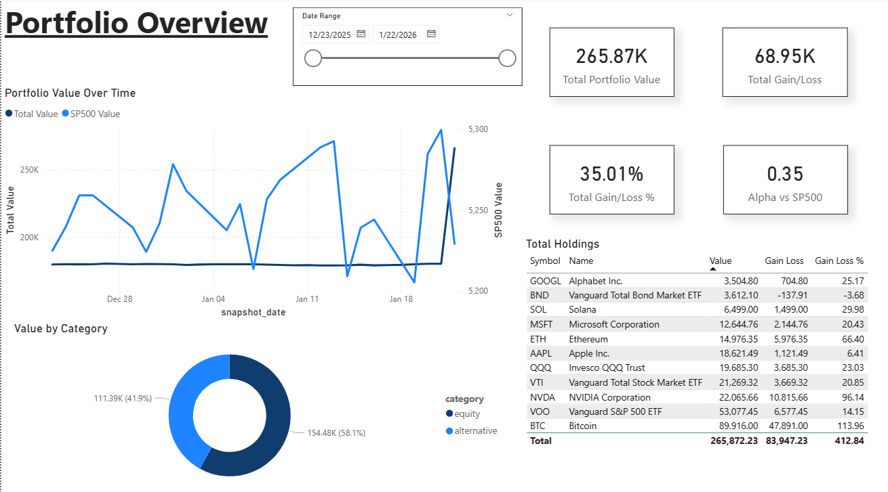
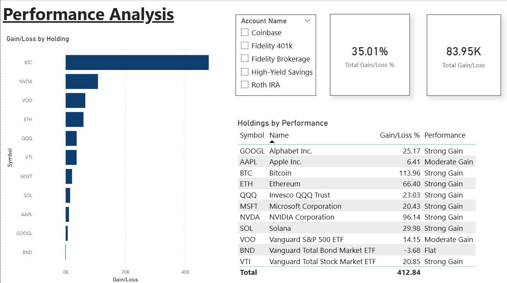
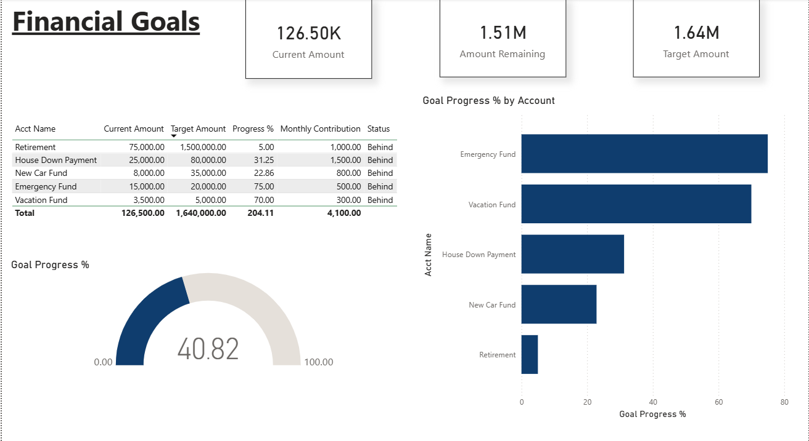
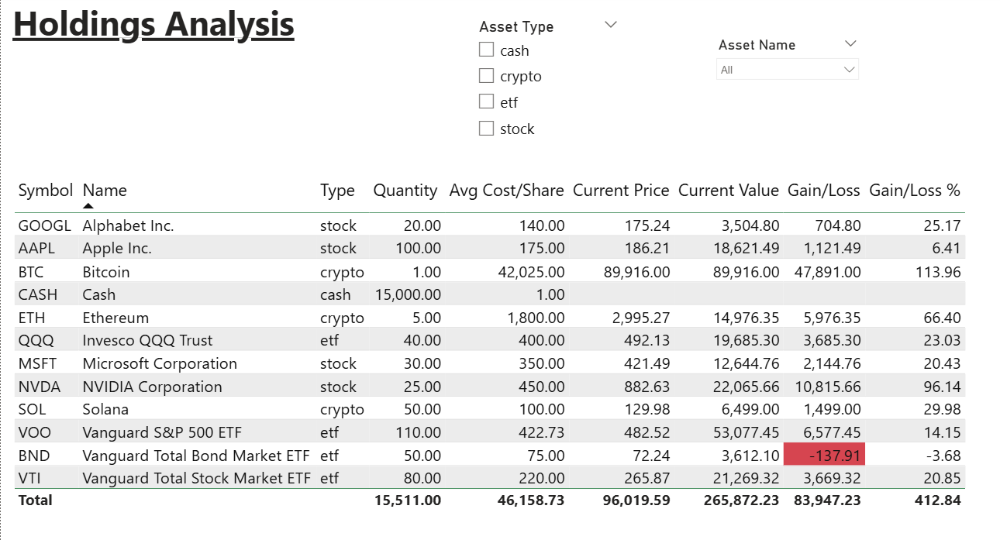
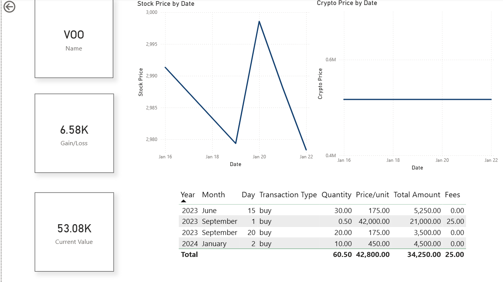
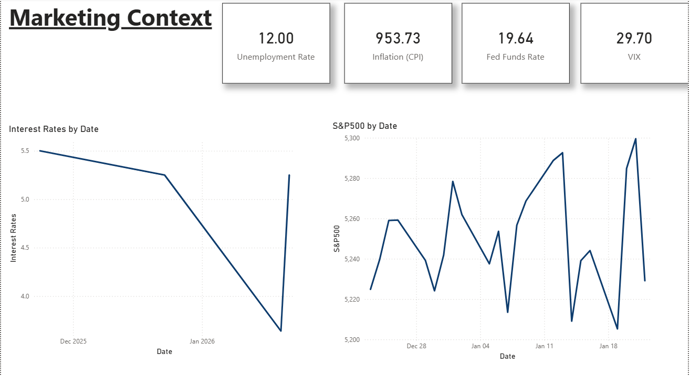
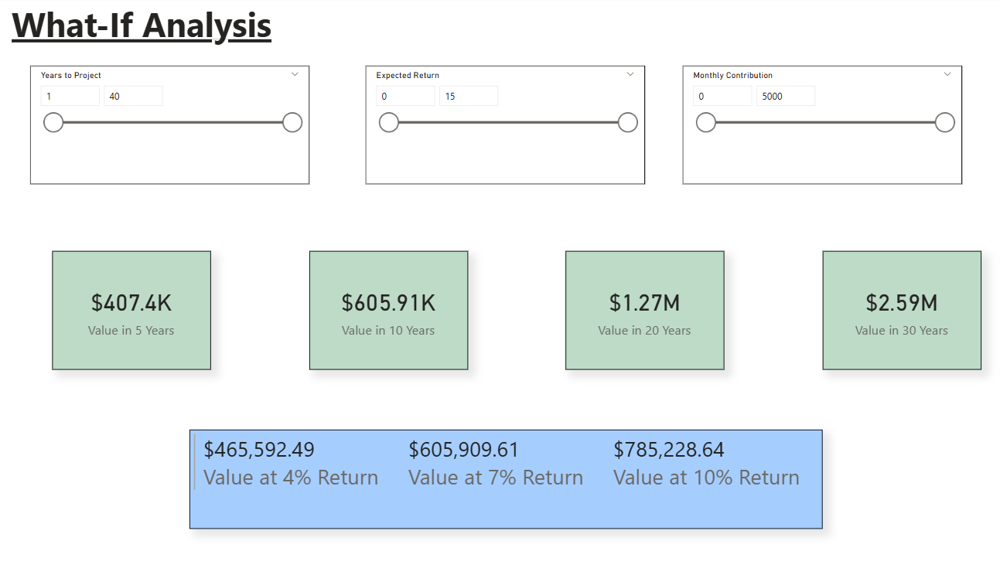

# Personal Finance & Investment Portfolio Dashboard

A comprehensive personal finance command center that tracks investments, monitors market trends, and visualizes the path to financial goals — built on Power BI with live data automation via Supabase and n8n.



---

## 📊 Overview

This project answers the question:

**How is my money actually performing, and am I on track to meet my financial goals?**

Most people track their finances across multiple apps, spreadsheets, and brokerage accounts with no unified view. This dashboard consolidates everything into a single command center that automatically:
- Pulls live stock, crypto, and economic data from public APIs
- Tracks portfolio performance against market benchmarks like the S&P 500
- Monitors progress toward financial goals with on-track indicators
- Projects future wealth under different contribution and return scenarios

Rather than a static snapshot, this project functions as a **continuously updating personal finance intelligence platform**.

---

## 🔍 Key Insights

This dashboard is designed to surface answers to the financial questions that matter most:

- **Am I beating the market?** — Compare portfolio returns directly against the S&P 500 to understand whether active investment decisions are adding value
- **Where is my money concentrated?** — Allocation breakdowns reveal whether a portfolio is diversified or over-exposed to a single asset class or sector
- **Which holdings are driving performance?** — Drill into individual assets to identify top performers and underperformers dragging down returns
- **How do macroeconomic conditions affect my portfolio?** — Track interest rates, inflation, and market volatility alongside portfolio value to spot correlations
- **Am I saving enough to hit my goals?** — Goal tracking with monthly contribution projections shows whether current habits will reach targets on time
- **What happens if I adjust my strategy?** — What-If analysis lets you model different contribution levels and return scenarios to see how small changes compound over time

---

## 🛠️ Tech Stack

| Component | Technology | Cost |
|-----------|------------|------|
| Database | PostgreSQL (Supabase) | Free tier |
| Data Pipeline | n8n (workflow automation) | Free / self-hosted |
| Visualization | Power BI Desktop | Free |
| Stock Data | Alpha Vantage API | Free |
| Crypto Data | CoinGecko API | Free |
| Economic Data | FRED API | Free |

---

## 📐 Architecture

```
┌─────────────────┐     ┌─────────────┐     ┌─────────────┐     ┌─────────────┐
│   Data Sources  │ --> │     n8n     │ --> │  Supabase   │ --> │  Power BI   │
│  (APIs/Manual)  │     │ (Pipelines) │     │ (PostgreSQL)│     │ (Dashboard) │
└─────────────────┘     └─────────────┘     └─────────────┘     └─────────────┘
```

**Data Sources:**
- Alpha Vantage (stocks/ETFs)
- CoinGecko (cryptocurrency)
- FRED API (economic indicators)
- Manual entry (holdings, goals)

---

## 📁 Repository Structure

```
personal-finance-dashboard/
├── database/           # SQL schema, views, functions, seed data
├── n8n-workflows/      # Automated data pipeline exports
├── powerbi/            # Power BI dashboard file (.pbix)
├── screenshots/        # Dashboard screenshots
├── docs/               # Setup guides
└── README.md
```

---

## 📈 Dashboard Pages

### 1. Portfolio Overview
Total portfolio value, allocation breakdown, gain/loss metrics, and holdings summary.


### 2. Performance Analysis
Gain/loss by holding, performance categories, and account-level filtering.



### 3. Goal Tracking
Progress toward financial goals with on-track status indicators.



### 4. Holdings Analysis
Detailed holdings table with slicers for account and asset type filtering.



### 5. Holdings Detail (Drill-Through)
Individual asset price history and transaction history, accessible by right-clicking any holding.



### 6. Market Context
Economic indicators (Fed Rate, CPI, Unemployment, VIX) and S&P 500 trend.



### 7. What-If Analysis
Interactive projections with adjustable monthly contribution, expected return, and time horizon parameters. Includes sensitivity analysis at 4%, 7%, and 10% return scenarios.



---

## ⚙️ Setup Instructions

This project involves multiple external tools (Supabase, n8n, Power BI). Each step below links to a detailed setup guide in the `docs/` folder for reference.

### Prerequisites
- Supabase account (free tier)
- n8n account (cloud or self-hosted)
- Power BI Desktop (free)
- API keys: Alpha Vantage, FRED (CoinGecko requires no key)

### Step 1: API Keys
Get free API keys from Alpha Vantage and FRED. CoinGecko requires no key.
📄 [Detailed guide →](docs/api-setup.md)

### Step 2: Database Setup
1. Create a new Supabase project
2. Run `database/schema.sql` in the SQL editor
3. Run `database/views.sql`
4. Run `database/functions.sql`
5. Run `database/seed-data.sql`

📄 [Detailed guide →](docs/supabase-setup.md)

### Step 3: Data Pipelines
1. Import workflows from `n8n-workflows/` into n8n
2. Configure PostgreSQL credentials with your Supabase connection
3. Add API keys to HTTP request nodes
4. Activate scheduled workflows

📄 [Detailed guide →](docs/n8n-setup.md)

### Step 4: Power BI Dashboard
1. Open the `.pbix` file from `powerbi/` in Power BI Desktop
2. Update the data source to point to your Supabase instance
3. Refresh data

📄 [Detailed guide →](docs/powerbi-setup.md)

---

## 🧠 Skills Demonstrated

- **Power BI** — Data modeling, DAX measures, interactive visualizations, drill-through navigation
- **SQL** — PostgreSQL schema design, views, functions, indexing (via Supabase)
- **Data Pipeline Design** — Automated ETL workflows with n8n
- **API Integration** — Alpha Vantage, CoinGecko, FRED
- **Financial Analysis** — Portfolio returns, benchmark comparison, compound growth projections

---

## 📬 Contact

**Theodore Romero**
- LinkedIn: https://linkedin.com/in/theodoreromero
- Email: p.theodore.romero@gmail.com

---

## 📄 License

This project is open source and available under the MIT License.
